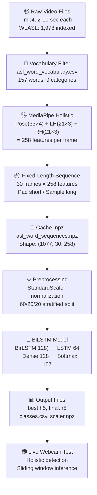

# 📋 ASL Unified Word Training — Full Report & ClickUp Integration Guide

> **Date:** April 11, 2026  
> **Module:** `SLR Main / Words / ASL Word (English)`  
> **Notebook:** `Unified_Word_Training_Version2.ipynb`  
> **Live Test:** `ASL_Word_Live_Test (1).ipynb`

---

## Table of Contents

1. [Executive Summary](#1-executive-summary)
2. [System Overview](#2-system-overview)
3. [Dataset & Vocabulary](#3-dataset--vocabulary)
4. [Feature Extraction Pipeline](#4-feature-extraction-pipeline)
5. [Model Architecture](#5-model-architecture)
6. [Training Configuration & Results](#6-training-configuration--results)
7. [Evaluation Metrics](#7-evaluation-metrics)
8. [Output Files Reference](#8-output-files-reference)
9. [Live Inference Notebook](#9-live-inference-notebook)
10. [Known Issues & Recommendations](#10-known-issues--recommendations)
11. [ClickUp Integration Guide](#11-clickup-integration-guide)

---

## 1. Executive Summary

The **Unified Word Training Version 2** notebook is the core training pipeline for the ASL (American Sign Language) word-level recognition system. It processes video clips from the WLASL dataset through MediaPipe Holistic to extract **258-feature** pose-aware keypoints (pose + both hands), trains a **BiLSTM** neural network to classify **157 sign language words**, and exports all required artifacts for real-time live inference.

### Key Highlights

| Metric | Value |
|---|---|
| **Words Recognized** | 157 bilingual words (9 categories) |
| **Feature Dimension** | 258 per frame (Pose: 132 + Left Hand: 63 + Right Hand: 63) |
| **Sequence Length** | 30 frames per video |
| **Total Samples Extracted** | 1,077 (from 1,978 indexed videos) |
| **Model Parameters** | 508,317 (507,677 trainable) |
| **Best Validation Accuracy** | 9.77% (Epoch 31) |
| **Test Accuracy** | 8.33% |
| **Top-5 Test Accuracy** | 19.91% |
| **Training Time** | ~41 epochs, early stopped |
| **Extraction Time** | 1 hour 42 minutes (first run; cached thereafter) |

> [!IMPORTANT]
> The current accuracy is low due to a very small number of samples per class (~6.8 avg) spread across 157 classes. This is expected for the WLASL dataset at this vocabulary scale. Accuracy improvements require **more training data** or **data augmentation**.

---

## 2. System Overview

### End-to-End Architecture



### Notebook Cell Breakdown

| Cell | Name | Purpose | Runtime |
|---|---|---|---|
| **1** | Imports | Load TensorFlow 2.10, MediaPipe, sklearn, etc. | ~2s |
| **2** | Global Config | Set `LANGUAGE="asl"`, paths, 258-feature config | Instant |
| **3** | GPU Setup | Enable memory growth on GPU | ~1s |
| **4** | Load Vocab | Read `asl_word_vocabulary.csv` (157 words) | ~1s |
| **5** | MediaPipe Helpers | Define `extract_tier3_keypoints()` (Holistic 258-feat) | Instant |
| **6** | Build Sample List | Parse `WLASL_v0.3.json` → 1,978 video paths | ~2s |
| **7** | Extract / Load Cache | Process all videos via Holistic OR load .npz cache | **1h42m** / instant |
| **8** | Preprocess + Split | StandardScaler, LabelEncoder, 60/20/20 split | ~3s |
| **9** | Build Model | BiLSTM architecture, compile with Adam | ~2s |
| **10** | Train | 60 max epochs, EarlyStopping, ReduceLR | ~45s |
| **11** | Evaluation | Test metrics, classification report, confusion matrix | ~5s |
| **12** | Summary | Print run confirmation | Instant |

---

## 3. Dataset & Vocabulary

### WLASL Dataset

| Property | Value |
|---|---|
| **Full Name** | Word-Level American Sign Language |
| **Source** | [Kaggle](https://www.kaggle.com/datasets/risangbaskoro/wlasl-processed) |
| **Total Videos (unfiltered)** | 11,980 |
| **Metadata JSON** | `WLASL_v0.3.json` (11.9 MB) |
| **Videos Used (after vocab filter)** | 1,978 indexed → **1,077 extracted** |
| **Rejection Criteria** | Videos with <20% hand detection rate are skipped |
| **Storage Location** | `M:\Term 10\Grad\Words dataset\Words Datasets\WLASL_videos\` |

### Vocabulary Breakdown (157 Words, 9 Categories)

| Category | Count | Example Words |
|---|---|---|
| **Verbs** | 27 | drink, help, walk, eat, open, close, sleep, think, love, hate |
| **Family** | 20 | mother, father, brother, sister, baby, grandfather, uncle, cousin |
| **Adjectives** | 21 | thin, tall, short, happy, beautiful, ugly, rich, poor, brave, strong |
| **Objects** | 23 | chair, table, bed, door, knife, key, camera, television, telephone |
| **Health** | 19 | doctor, medicine, headache, sick, hospital, pain, heart, allergy |
| **Directions** | 16 | right, left, inside, outside, under, up, here, there, near, far |
| **Jobs** | 11 | teacher, engineer, lawyer, pilot, farmer, manager, policeman, chef |
| **Social** | 9 | welcome, thank you, wedding, divorce, party, gift, engagement |
| **Religion** | 11 | god, religion, pray, church, angel, heaven, spirit, forgive |

### Vocabulary Files

| File | Location | Purpose |
|---|---|---|
| `asl_word_vocabulary.csv` | `Words/ASL Word (English)/` | Per-language vocab: `word_id`, `label_name`, `source_class_id` |
| `shared_word_vocabulary.csv` | `Words/Shared/` | Bilingual bridge: English ↔ Arabic word mapping |

---

## 4. Feature Extraction Pipeline

### Upgrade from V1 → V2: 63 → 258 Features

The V2 notebook introduced **MediaPipe Holistic** (replacing Hands-only) to capture full upper-body context:

| Component | Landmarks | Features | Purpose |
|---|---|---|---|
| **Pose** | 33 landmarks × 4 (x, y, z, visibility) | **132** | Upper body spatial context |
| **Left Hand** | 21 landmarks × 3 (x, y, z) | **63** | Left hand shape |
| **Right Hand** | 21 landmarks × 3 (x, y, z) | **63** | Right hand shape |
| **Total** | — | **258** | Complete pose-aware representation |

### Extraction Function: `extract_tier3_keypoints()`

```python
def extract_tier3_keypoints(frame_bgr, holistic_obj):
    # 1. Pose: 33 × 4 = 132 features
    # 2. Left Hand: 21 × 3 = 63 features  
    # 3. Right Hand: 21 × 3 = 63 features
    # → Concatenate = 258 features per frame
    vec = np.concatenate([pose, lh, rh])
    return vec, has_hand
```

### Temporal Normalization: `to_fixed_sequence()`

| Scenario | Action |
|---|---|
| Video has **≥30 frames** | Uniformly sample 30 frames (even spacing) |
| Video has **<30 frames** | Zero-pad remaining frames |
| Video has **0 frames** | Return all-zero tensor |

### Extraction Stats from Last Run

- **Indexed Samples:** 1,978
- **Successfully Extracted:** 1,077 (54.4% success rate)
- **Rejected:** 901 (missing video files or <20% hand detection)
- **Extraction Time:** 1 hour 42 minutes 49 seconds
- **Cache File:** `asl_word_sequences.npz` (~7.4 MB compressed)

---

## 5. Model Architecture

### BiLSTM Network (Sequential)

```
┌─────────────────────────────────────────────────────────────────┐
│  INPUT                    shape = (30, 258)                     │
│    30 time steps × 258 features                                 │
├─────────────────────────────────────────────────────────────────┤
│  BIDIRECTIONAL LSTM       128 units → 256 output                │
│    return_sequences=True                                        │
│    cuDNN-accelerated (no recurrent_dropout)                     │
│    Params: 396,288                                              │
├─────────────────────────────────────────────────────────────────┤
│  BATCH NORMALIZATION      Params: 1,024                         │
│  DROPOUT                  0.3                                   │
├─────────────────────────────────────────────────────────────────┤
│  LSTM                     64 units                              │
│    return_sequences=False (final hidden state only)             │
│    Params: 82,176                                               │
├─────────────────────────────────────────────────────────────────┤
│  BATCH NORMALIZATION      Params: 256                           │
│  DROPOUT                  0.3                                   │
├─────────────────────────────────────────────────────────────────┤
│  DENSE                    128 units, ReLU activation            │
│    Params: 8,320                                                │
│  DROPOUT                  0.2                                   │
├─────────────────────────────────────────────────────────────────┤
│  DENSE (OUTPUT)           157 units, Softmax (float32)          │
│    Params: 20,253                                               │
└─────────────────────────────────────────────────────────────────┘

Total params:     508,317
Trainable params: 507,677
Non-trainable:    640
```

### Why BiLSTM for Words?

| Aspect | Letters (MLP) | Words (BiLSTM) |
|---|---|---|
| **Input** | Single image → (1, 63) | 30-frame video → (30, 258) |
| **Model** | Dense layers only | Temporal LSTM layers |
| **Learns** | Static hand shape | Hand shape **changes over time** |
| **Example** | 🤚 = letter "B" | 🤚→✊→👉 = word "help" |

---

## 6. Training Configuration & Results

### Hyperparameters

| Parameter | Value |
|---|---|
| **Optimizer** | Adam (initial LR: 1e-3) |
| **Loss** | Categorical Cross-Entropy |
| **Batch Size** | 32 |
| **Max Epochs** | 60 |
| **Data Split** | 60% train / 20% val / 20% test |
| **Callbacks** | ModelCheckpoint, EarlyStopping (patience=10), ReduceLROnPlateau (factor=0.5, patience=4) |

### Training Progression

| Epoch | Train Acc | Train Loss | Val Acc | Val Loss | LR | Event |
|---|---|---|---|---|---|---|
| 1 | 1.24% | 5.3154 | 0.93% | 5.0429 | 1e-3 | — |
| 5 | 6.35% | 4.5855 | 3.26% | 4.9145 | 1e-3 | — |
| 10 | 13.78% | 3.9454 | 4.65% | 4.6388 | 1e-3 | — |
| 15 | 21.98% | 3.3375 | 5.58% | 4.5116 | 1e-3 | — |
| 20 | 30.65% | 2.7889 | 7.91% | 4.6704 | 1e-3 | Best at this point |
| 21 | 33.13% | 2.6985 | 7.44% | 4.5777 | → 5e-4 | LR reduced |
| 25 | 44.27% | 2.1840 | 7.44% | 4.7158 | → 2.5e-4 | LR reduced |
| **31** | **52.32%** | **1.8442** | **9.77%** | **4.6777** | 1.25e-4 | **🏆 Best checkpoint** |
| 41 | 58.36% | 1.6911 | 9.30% | 4.7014 | 1.56e-5 | ⛔ Early stopping |

### Data Split Shapes

| Split | Samples | Shape |
|---|---|---|
| **Train** | 646 | `(646, 30, 258)` |
| **Validation** | 215 | `(215, 30, 258)` |
| **Test** | 216 | `(216, 30, 258)` |

### Observations

> [!WARNING]
> The **large gap** between training accuracy (52%) and validation accuracy (9.77%) indicates significant **overfitting**. This is primarily caused by:
> 
> - **Very few samples per class** (~6.8 average across 157 classes)
> - **High class imbalance** (some classes have 0 test samples)
> - **901 rejected videos** from the 1,978 indexed
>
> This is a known limitation of the WLASL dataset at this vocabulary size.

---

## 7. Evaluation Metrics

### Test Set Results

| Metric | Score |
|---|---|
| **Top-1 Accuracy** | **8.33%** |
| **Top-5 Accuracy** | **19.91%** |
| **Test Loss** | 4.6220 |
| **Macro Precision** | 0.04 |
| **Macro Recall** | 0.06 |
| **Macro F1** | 0.04 |
| **Weighted F1** | 0.06 |
| **Confusion Matrix Shape** | (147, 147) |

### Best-Performing Classes (Non-Zero Recall)

| Word | Precision | Recall | F1-Score | Support |
|---|---|---|---|---|
| angel | 0.50 | 1.00 | 0.67 | 2 |
| inside | 0.50 | 1.00 | 0.67 | 1 |
| love | 1.00 | 0.50 | 0.67 | 2 |
| muscle | 0.50 | 1.00 | 0.67 | 1 |
| choose | 1.00 | 0.33 | 0.50 | 3 |
| grandfather | 0.50 | 0.50 | 0.50 | 2 |
| bed | 0.50 | 0.33 | 0.40 | 3 |
| build | 0.25 | 1.00 | 0.40 | 1 |
| party | 0.25 | 1.00 | 0.40 | 1 |
| smart | 0.25 | 1.00 | 0.40 | 1 |

### Classes with Zero Samples in Test Set

10 classes had **0 test samples**: afraid, between, brave, chef, church, cry, diarrhea, diabetes, honest, humble, etc.

---

## 8. Output Files Reference

### Training Outputs (Generated by `Unified_Word_Training_Version2.ipynb`)

| # | File | Size | Purpose | Path |
|---|---|---|---|---|
| 1 | `asl_word_lstm_model_best.h5` | ~6.2 MB | Best checkpoint (val_accuracy @ Epoch 31) | `Words/ASL Word (English)/` |
| 2 | `asl_word_lstm_model_final.h5` | ~6.2 MB | Final model after early stopping | `Words/ASL Word (English)/` |
| 3 | `asl_word_classes.csv` | ~3 KB | Class mapping: `model_class_index` → `label_name` → `source_class_id` → `word_id` | `Words/ASL Word (English)/` |
| 4 | `asl_word_sequences.npz` | ~7.4 MB | Cached extracted sequences: `X=(1077,30,258)`, `y_text=(1077,)` | `Words/ASL Word (English)/` |
| 5 | `asl_scaler_stats.npz` | ~2.4 KB | StandardScaler mean/scale for feature normalization | `Words/ASL Word (English)/` |

### Input / Reference Files (Required)

| # | File | Purpose |
|---|---|---|
| 6 | `asl_word_vocabulary.csv` | Vocabulary definition: 157 words with `word_id`, `label_name`, `source_class_id` |
| 7 | `shared_word_vocabulary.csv` | Bilingual word mapping (English ↔ Arabic) for cross-language translation |
| 8 | `WLASL_v0.3.json` | Video metadata: maps `class_id` → video instances |

### Live Test Required Files

| # | File | Used By |
|---|---|---|
| 1 | `asl_word_lstm_model_final.h5` | Model weights |
| 2 | `asl_word_classes.csv` | Class index → word name mapping |
| 3 | `asl_scaler_stats.npz` | Runtime feature normalization |
| 4 | `shared_word_vocabulary.csv` | English → Arabic bilingual display |

---

## 9. Live Inference Notebook

### `ASL_Word_Live_Test (1).ipynb`

The live test notebook provides **real-time webcam-based ASL word recognition** using the trained model.

### Architecture

| Component | Detail |
|---|---|
| **Feature Extractor** | MediaPipe Holistic (Pose + Both Hands = 258 features) |
| **Model Complexity** | 0 (fastest for real-time) |
| **CPU Mode** | Forced via `CUDA_VISIBLE_DEVICES = "-1"` |
| **Sliding Window** | Buffers last 30 frames continuously |
| **Prediction Interval** | Every 0.5 seconds |
| **Confidence Threshold** | 35% minimum |
| **Stability Window** | 3 consecutive same predictions to confirm |
| **Cooldown** | 2.0 seconds between confirmed words |

### Live Test Features

- ✅ **Two-hand tracking** with pose (258 features)
- ✅ **Memory-based pose fallback** (uses last known pose if body temporarily lost)
- ✅ **Top-3 predictions** displayed on screen
- ✅ **Confidence bar** with color coding (Green >60%, Yellow >40%, Orange otherwise)
- ✅ **Sentence building** (words accumulate on screen)
- ✅ **Hand count indicator** (0/2, 1/2, 2/2)
- ✅ **FPS counter** (real-time performance monitoring)
- ✅ **Keyboard controls**: `Q` quit, `R` reset, `SPACE` add space, `BACKSPACE` delete

### Live Test Cell Structure

| Cell | Purpose |
|---|---|
| Cell 1 | Imports & force CPU mode |
| Cell 2 | Configuration (paths, thresholds, camera settings) |
| Cell 3 | Load model, scaler, vocabulary mapping |
| Cell 4 | MediaPipe Holistic hand detector setup |
| Cell 5 | Live webcam loop with prediction & UI overlay |

---

## 10. Known Issues & Recommendations

### Current Issues

| Issue | Impact | Suggested Fix |
|---|---|---|
| **Low accuracy (8.33%)** | Model generalizes poorly | More data, data augmentation (flip, time-warp) |
| **Severe overfitting** | Train ~52% vs Val ~9.8% | Add L2 regularization, heavier dropout, more data |
| **~900 rejected videos** | Only 54% of indexed videos used | Lower detection threshold, use pose-only fallback |
| **Class imbalance** | Some classes have 0 test samples | Balanced class weights, oversampling minority classes |
| **Live test on CPU** | Slower than GPU inference | Remove `CUDA_VISIBLE_DEVICES = "-1"` if GPU available |

### Recommended Next Steps

1. **Data Augmentation**: Add horizontal flip, time-stretch, noise injection
2. **Class Weights**: Use `compute_class_weight('balanced')` during training
3. **Increase Epochs**: Remove early stopping temporarily, try 100+ epochs
4. **Transfer Learning**: Consider pre-trained pose embeddings
5. **Reduce Classes**: Train on top-50 words first to validate pipeline
6. **ArSL Training**: Download KArSL dataset and run with `LANGUAGE="arsl"`

---

## 11. ClickUp Integration Guide

Based on your ClickUp workspace structure (**Graduation Workspace → Team Space → Project 1 / Project 2 / Project Notes**), here is a step-by-step guide to organize this work.

### Your ClickUp Structure (from screenshot)

```
📦 Graduation Workspace
└── 📂 Team Space
    ├── 📋 Project 1        ← Active tasks (3 tasks visible)
    ├── 📋 Project 2        ← Secondary tasks (1 task)
    └── 📄 Project Notes    ← Documentation
```

---

### Step 1: Create a List in Project 1 for the ASL Pipeline

1. **Click** on **Project 1** in the sidebar
2. Click **`+ Add Channel`** or **`+ View`** → **List**
3. Name it: **`ASL Word Recognition Pipeline`**

---

### Step 2: Add Tasks to the List

Create each of these tasks inside the list. For each task, use the **Board** or **List** view, click **`+ Add Task`**, and fill in the details.

#### Task 1: `[Training] Unified Word Training v2 — Feature Extraction`

| Field | Value |
|---|---|
| **Status** | ✅ Complete |
| **Priority** | 🔴 High |
| **Assignee** | You |
| **Due Date** | (Date you ran the extraction) |
| **Tags** | `training`, `mediapipe`, `data-processing` |
| **Description** | (paste below) |

**Description to paste:**
```
Feature Extraction with MediaPipe Holistic (258 features)

Notebook: Unified_Word_Training_Version2.ipynb (Cells 1-7)

✅ Upgraded from 63-feature (hands-only) to 258-feature (Pose + Both Hands)
✅ Extracted 1,077 samples from 1,978 indexed WLASL videos
✅ Extraction time: 1 hour 42 minutes
✅ Cache saved: asl_word_sequences.npz (7.4 MB)

Feature breakdown:
- Pose: 33 landmarks × 4 = 132 features  
- Left Hand: 21 landmarks × 3 = 63 features
- Right Hand: 21 landmarks × 3 = 63 features
- Total: 258 features per frame × 30 frames

Output files:
- asl_word_sequences.npz → cached extracted data
- asl_scaler_stats.npz → normalization parameters
```

---

#### Task 2: `[Training] Unified Word Training v2 — Model Training`

| Field | Value |
|---|---|
| **Status** | ✅ Complete |
| **Priority** | 🔴 High |
| **Assignee** | You |
| **Tags** | `training`, `bilstm`, `deep-learning` |
| **Description** | (paste below) |

**Description to paste:**
```
BiLSTM Model Training (157 classes)

Notebook: Unified_Word_Training_Version2.ipynb (Cells 8-10)

Architecture:
- Bi(LSTM 128) → BN → Drop(0.3) → LSTM 64 → BN → Drop(0.3)  
  → Dense 128 → Drop(0.2) → Softmax 157
- Total params: 508,317

Training Config:
- Split: 646 train / 215 val / 216 test
- Optimizer: Adam (LR 1e-3 → reduced 5x via ReduceLROnPlateau)
- Epochs: 41 (early stopped at patience=10)
- Best val_accuracy: 9.77% at Epoch 31

Output files:
- asl_word_lstm_model_best.h5 (6.2 MB) — best checkpoint
- asl_word_lstm_model_final.h5 (6.2 MB) — final model
- asl_word_classes.csv — 157 class mappings
```

---

#### Task 3: `[Evaluation] ASL Word Model — Test Metrics`

| Field | Value |
|---|---|
| **Status** | ✅ Complete |
| **Priority** | 🟡 Normal |
| **Tags** | `evaluation`, `metrics` |
| **Description** | (paste below) |

**Description to paste:**
```
Model Evaluation Results

Notebook: Unified_Word_Training_Version2.ipynb (Cell 11)

Test Set Metrics:
- Top-1 Accuracy: 8.33%
- Top-5 Accuracy: 19.91%
- Test Loss: 4.6220
- Macro F1: 0.04
- Confusion Matrix: 147 × 147

Best-performing words: angel (F1=0.67), inside (F1=0.67), 
love (F1=0.67), muscle (F1=0.67), choose (F1=0.50)

⚠️ Severe overfitting: Train 52% vs Val 9.8%
Cause: ~6.8 avg samples/class across 157 classes

Recommended improvements:
- Data augmentation (flip, time-warp)
- Balanced class weights  
- Reduce to top-50 words initially
```

---

#### Task 4: `[Inference] ASL Word Live Webcam Test`

| Field | Value |
|---|---|
| **Status** | ✅ Complete |
| **Priority** | 🔴 High |
| **Tags** | `inference`, `live-test`, `webcam` |
| **Description** | (paste below) |

**Description to paste:**
```
Real-Time Webcam ASL Word Recognition

Notebook: ASL_Word_Live_Test (1).ipynb

Features:
- Uses MediaPipe Holistic (258 features, model_complexity=0)
- Sliding window: 30-frame buffer → predict every 0.5s
- Stability window: 3 consecutive same predictions to confirm
- Sentence building with live display
- Two-hand tracking with pose-aware fallback memory
- CPU mode (forced for stability)

Requires:
- asl_word_lstm_model_final.h5
- asl_word_classes.csv  
- asl_scaler_stats.npz
- shared_word_vocabulary.csv

Controls: Q=quit, R=reset, SPACE=add space, BACKSPACE=delete
```

---

#### Task 5: `[Improvement] Data Augmentation & Accuracy Boost`

| Field | Value |
|---|---|
| **Status** | 📌 To Do |
| **Priority** | 🔴 Urgent |
| **Tags** | `improvement`, `accuracy`, `augmentation` |
| **Description** | (paste below) |

**Description to paste:**
```
Improve ASL Word Model Accuracy

Current: Top-1 = 8.33%, Top-5 = 19.91%
Target: Top-1 > 25%, Top-5 > 50%

Action items:
☐ Add horizontal flip augmentation  
☐ Add temporal augmentation (speed up/slow down)
☐ Add noise injection to landmarks
☐ Implement balanced class weights
☐ Try reducing to top-50 most-sampled words
☐ Experiment with Transformer encoder instead of BiLSTM
☐ Try larger LSTM units (256/128 instead of 128/64)
☐ Increase patience and max epochs (100+)
```

---

#### Task 6: `[Data] ArSL (Arabic) Word Training`

| Field | Value |
|---|---|
| **Status** | 📌 To Do |
| **Priority** | 🟡 Normal |
| **Tags** | `arabic`, `karsl`, `training` |
| **Description** | (paste below) |

**Description to paste:**
```
Arabic Sign Language Word Training

Same notebook: Unified_Word_Training_Version2.ipynb  
Change: LANGUAGE = "arsl"

Prerequisites:
☐ Download KArSL-502 from Kaggle
☐ Extract to Words/Datasets/KArSL_502/
☐ Create arsl_word_vocabulary.csv (auto-generated from shared vocab)

Status: Blocked — waiting for KArSL dataset download
```

---

### Step 3: Add Documentation to Project Notes

1. Click on **📄 Project Notes** in the sidebar
2. Click **`+ Add Page`** or **`+ Add Doc`**
3. Create these documentation pages:

#### Doc 1: `ASL Word Pipeline — Architecture & Data Flow`
> Copy the content from `Words/Docs/ARCHITECTURE_AND_PIPELINE.md`

#### Doc 2: `ASL Word Pipeline — Model Technical Specs`
> Copy the content from `Words/Docs/MODEL_SUMMARY.md`

#### Doc 3: `Output Files Reference`
> Copy Section 8 from this report (Output Files Reference table)

#### Doc 4: `Complete Bilingual Word List (157 Words)`
> Copy the content from `Words/Docs/COMPLETE_WORD_LIST.md`

---

### Step 4: Add Custom Fields (Optional but Recommended)

Go to **Project 1** → **Settings** (⚙️) → **Custom Fields** → Add these:

| Field Name | Field Type | Options/Description |
|---|---|---|
| `Component` | Dropdown | `Training`, `Inference`, `Data`, `Evaluation`, `Improvement` |
| `Notebook` | Short Text | The notebook filename |
| `Accuracy` | Number | Current Top-1 accuracy |
| `Output Files` | Long Text | List of generated files |

---

### Step 5: Set Up Board View Statuses

In **Project 1** → Board view, configure these status columns:

| Status | Color | Used For |
|---|---|---|
| **To Do** | Gray | Planned tasks |
| **In Progress** | Blue | Currently working on |
| **Testing** | Yellow | Running/evaluating |
| **Complete** | Green | Done and verified |
| **Blocked** | Red | Waiting on dependencies |

---

### Quick Reference: ClickUp Task Summary

| # | Task Title | Status | Priority |
|---|---|---|---|
| 1 | [Training] Feature Extraction (258-feat Holistic) | ✅ Complete | 🔴 High |
| 2 | [Training] BiLSTM Model Training (157 classes) | ✅ Complete | 🔴 High |
| 3 | [Evaluation] Test Metrics & Classification Report | ✅ Complete | 🟡 Normal |
| 4 | [Inference] Live Webcam Test (Holistic 258F) | ✅ Complete | 🔴 High |
| 5 | [Improvement] Data Augmentation & Accuracy Boost | 📌 To Do | 🔴 Urgent |
| 6 | [Data] ArSL Arabic Word Training (KArSL) | 📌 To Do | 🟡 Normal |

---

> [!TIP]
> **Pro tip for ClickUp:** You can also attach the actual notebook files (`.ipynb`) and output files (`.h5`, `.csv`) directly to each task using the **Attachments** section (📎 icon). This makes it easy for your team or supervisor to access everything from one place.

---

## Appendix: File Tree

```
SLR Main/
├── Words/
│   ├── ASL Word (English)/                      ← Main working directory
│   │   ├── Unified_Word_Training_Version2.ipynb  ← 🎯 TRAINING NOTEBOOK
│   │   ├── ASL_Word_Live_Test (1).ipynb          ← 🎯 LIVE TEST NOTEBOOK
│   │   ├── asl_word_lstm_model_best.h5           ← 📦 Output: best model
│   │   ├── asl_word_lstm_model_final.h5          ← 📦 Output: final model
│   │   ├── asl_word_classes.csv                  ← 📦 Output: class mapping
│   │   ├── asl_word_sequences.npz                ← 📦 Output: cached data
│   │   ├── asl_scaler_stats.npz                  ← 📦 Output: scaler params
│   │   ├── asl_word_vocabulary.csv               ← 📄 Input: vocabulary
│   │   └── shared_word_vocabulary.csv            ← 📄 Input: bilingual bridge
│   ├── ArSL Word (Arabic)/                       ← Arabic training (TBD)
│   ├── Shared/
│   │   └── shared_word_vocabulary.csv            ← 157 bilingual word mappings
│   └── Docs/
│       ├── ARCHITECTURE_AND_PIPELINE.md
│       ├── MODEL_SUMMARY.md
│       ├── DATASET_GUIDE.md
│       ├── TEAM_QUICKSTART.md
│       ├── COMPLETE_WORD_LIST.md
│       └── LETTERS_WORDS_INTEGRATION.md
└── README.md
```
