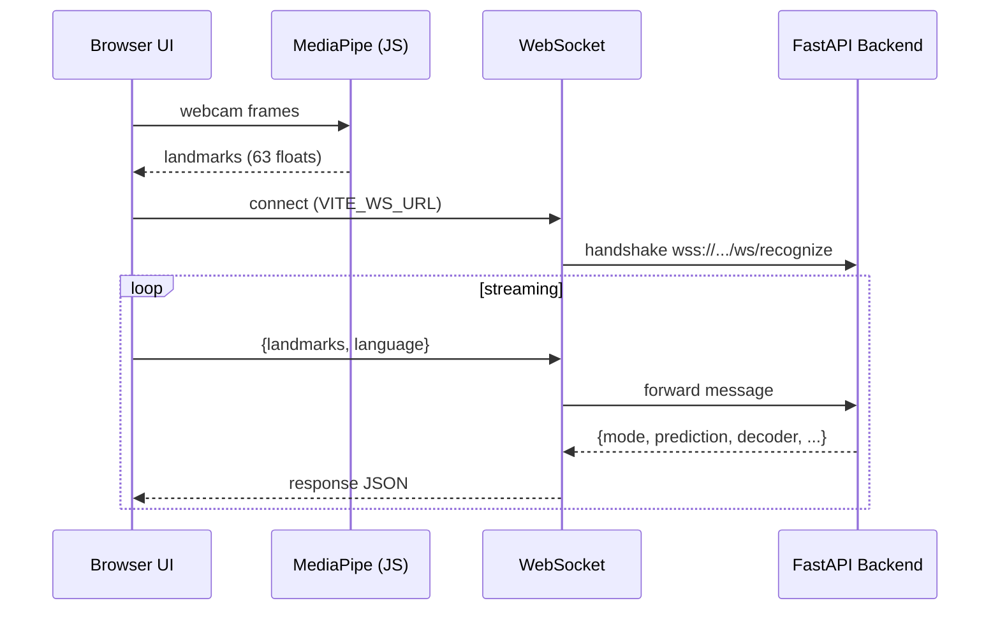
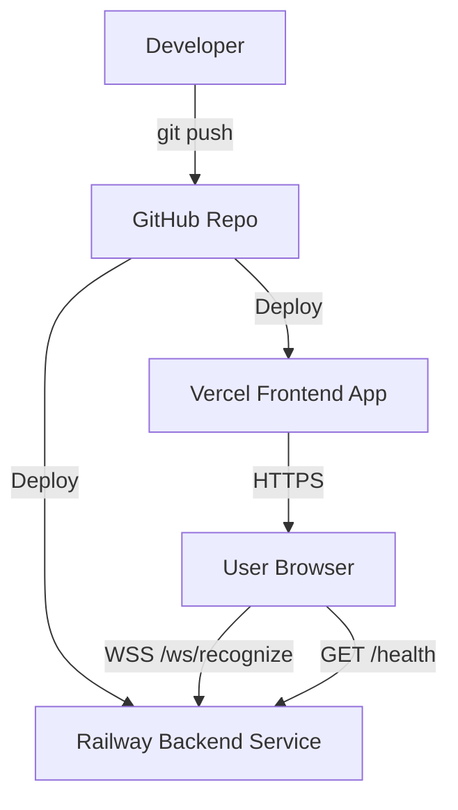
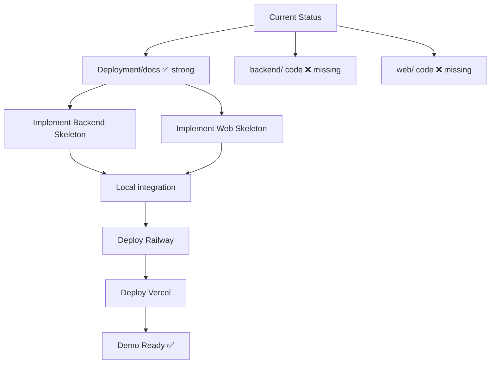
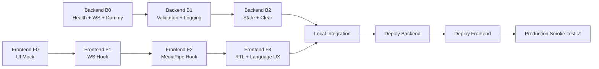

# SLR Graduation Project — Master Document (Full-Stack + Deployment + Alternatives + Progress)
**Date:** 2026-04-14  
**Repo:** `ahmed171102/SLR-Main`  
**Purpose:** Single, structured document that contains the **full-stack approach**, **deployment plan**, **tooling**, **progress status**, and **alternative approaches**, with **diagrams embedded**.

---

## Table of Contents
1. [Executive Summary](#executive-summary)  
2. [Target Architecture (Modern Full-Stack)](#target-architecture-modern-full-stack)  
3. [Core Data Flow (How the System Works)](#core-data-flow-how-the-system-works)  
4. [Repository Structure (Production-Ready)](#repository-structure-production-ready)  
5. [Frontend Approach (Modern Dark UI)](#frontend-approach-modern-dark-ui)  
6. [Backend Approach (API + WebSocket)](#backend-approach-api--websocket)  
7. [Integration Contract (Linking Frontend ↔ Backend)](#integration-contract-linking-frontend--backend)  
8. [Local Development Plan](#local-development-plan)  
9. [Cloud Deployment Plan (Railway + Vercel)](#cloud-deployment-plan-railway--vercel)  
10. [Testing & Acceptance Checklist](#testing--acceptance-checklist)  
11. [Progress Report (Current Status + Next Steps)](#progress-report-current-status--next-steps)  
12. [Technologies Needed (Current Recommended Stack)](#technologies-needed-current-recommended-stack)  
13. [Alternatives (Other Valid Approaches)](#alternatives-other-valid-approaches)  
14. [Common Issues & Fixes](#common-issues--fixes)  
15. [Timeline (Fastest Path to a Working Demo)](#timeline-fastest-path-to-a-working-demo)  

---

## Executive Summary

You are building a **modern real-time web system** that:
- Uses **MediaPipe Hands in the browser** to extract landmarks (privacy-friendly: no raw video upload)
- Streams **63-float landmark vectors** to a backend via **WebSocket**
- Backend returns standardized JSON responses
- Web UI displays camera overlay + prediction + confidence + built text/sentence
- Supports **English ↔ Arabic** toggle (including RTL display)

This master plan is designed to be “graduation-demo safe”:
- Start with **dummy predictions** first
- Integrate real inference later without changing deployment contracts

---

## Target Architecture (Modern Full-Stack)

### Diagram — System Overview
```mermaid
flowchart LR
  subgraph Frontend[Frontend (Vercel)]
    UI[React + Vite + TS\nModern Dark UI (Tailwind)]
    CAM[Camera + Canvas Overlay]
    MP[MediaPipe Hands JS\n(in browser)]
    WSClient[WebSocket Client]
    UI --> CAM --> MP --> WSClient
  end

  subgraph Backend[Backend (Railway)]
    API[FastAPI Service]
    WS[WS /ws/recognize]
    Health[GET /health]
    API --> WS
    API --> Health
  end

  WSClient <-->|63 floats + language\nJSON response| WS
```

---

## Core Data Flow (How the System Works)

### Diagram — Streaming Contract (Sequence)


---

## Repository Structure (Production-Ready)

> Keep backend and web independent so each can be deployed separately.

```text
SLR-Main/
├── backend/
│   ├── app/
│   │   ├── main.py
│   │   ├── config.py
│   │   ├── schemas.py
│   │   ├── routes/
│   │   │   ├── health.py
│   │   │   └── websocket.py
│   │   └── services/
│   │       ├── predictor.py
│   │       ├── validators.py
│   │       └── state.py
│   ├── requirements.txt
│   ├── Dockerfile
│   └── railway.toml (optional)
│
└── web/
    ├── package.json
    ├── tailwind.config.js
    ├── vercel.json
    ├── .env.example
    └── src/
        ├── main.tsx
        ├── App.tsx
        ├── pages/
        │   ├── Home.tsx
        │   └── Recognize.tsx
        ├── components/
        │   ├── TopBar.tsx
        │   ├── CameraPanel.tsx
        │   ├── ControlsCard.tsx
        │   ├── PredictionCard.tsx
        │   └── OutputCard.tsx
        ├── hooks/
        │   ├── useMediaPipe.ts
        │   └── useWebSocket.ts
        └── utils/
            ├── constants.ts
            └── landmarks.ts
```

---

## Frontend Approach (Modern Dark UI)

### UI layout (Recognize page)
- Desktop: **camera (2/3)** + **right panel (1/3)**
- Mobile: stacked

### Reusable Card Style (Tailwind)
Use this across all containers:
- `bg-gray-900 border border-gray-800 rounded-2xl shadow-lg shadow-black/20`
- Title: `text-xs uppercase tracking-widest text-gray-400`
- Body: `text-gray-100`

### Essential containers
1. **CameraPanel**
   - canvas (video+overlay)
   - status chips: connected, mode, hand detected
2. **ControlsCard**
   - Start/Stop
   - Clear
   - Language toggle EN/AR
3. **PredictionCard**
   - current label
   - confidence bar
   - top alternatives
4. **OutputCard**
   - built text/sentence
   - uses `dir="rtl"` for Arabic

---

## Backend Approach (API + WebSocket)

### Backend endpoints
- `GET /health` → `{ "status": "ok" }`
- `WS /ws/recognize`:
  - Receives JSON payloads
  - Validates payload shape
  - Returns standardized JSON response

### Backend reliability requirements
- Must never crash on bad payloads
- Must handle reconnects cleanly
- Must validate landmarks length (63)
- Must support `command: "clear"`

---

## Integration Contract (Linking Frontend ↔ Backend)

### Env vars (mandatory)
**Local**
```env
VITE_API_URL=http://localhost:8000
VITE_WS_URL=ws://localhost:8000/ws/recognize
```

**Production**
```env
VITE_API_URL=https://<railway-domain>
VITE_WS_URL=wss://<railway-domain>/ws/recognize
```

### Diagram — Linking via env vars + CORS
```mermaid
flowchart TD
  Web[Web App (Vercel)] -->|VITE_WS_URL (wss)| WS[Backend WS Endpoint]
  Web -->|VITE_API_URL (https)| REST[Backend REST /health]
  WS --> CORS[CORS allowlist checks Origin]
  REST --> CORS
  CORS --> OK[Allowed: Vercel + localhost]
```

---

## Local Development Plan

### Backend local run
```bash
cd backend
python -m venv .venv
# activate
pip install -r requirements.txt
uvicorn app.main:app --reload --host 0.0.0.0 --port 8000
```

### Web local run
```bash
cd web
npm install
npm run dev
```

### Local verification checklist
- `http://localhost:8000/health` returns OK
- Web shows Connected
- Webcam opens and overlay renders
- Backend logs show WS messages arriving

---

## Cloud Deployment Plan (Railway + Vercel)

### Diagram — Cloud Deployment Pipeline


### Backend → Railway steps
1. Railway: New Project → Deploy from GitHub
2. Ensure start command uses `$PORT`
3. Set environment variables (at least allowed origins)
4. Confirm `https://<railway>/health`

### Frontend → Vercel steps
1. Import repo
2. Root Directory: `web`
3. Build: `npm run build`
4. Output: `dist`
5. Set env vars: `VITE_API_URL`, `VITE_WS_URL`
6. Deploy and verify WS connection

---

## Testing & Acceptance Checklist

### Backend
- [ ] `/health` returns OK locally and on Railway
- [ ] WS connects locally and on Railway
- [ ] invalid payload returns `{ error: ... }` not crash
- [ ] clear command resets state

### Frontend
- [ ] loads on Vercel
- [ ] webcam permission works
- [ ] overlay shows landmarks
- [ ] connected badge updates correctly
- [ ] Arabic output uses RTL direction

### End-to-end
- [ ] `wss://` used in production
- [ ] stable for 5–10 minutes during demo

---

## Progress Report (Current Status + Next Steps)

### Diagram — Current repo status to demo-ready


### Current status (summary)
- Documentation is strong and detailed
- Next work is implementation of backend + web code from the plan

---

## Technologies Needed (Current Recommended Stack)

### Local tools
- Git
- Python 3.10/3.11
- Node.js 20 LTS + npm
- VS Code

### Backend packages
- fastapi
- uvicorn[standard]
- pydantic
- numpy

### Frontend packages
- react + react-dom
- vite
- typescript
- tailwindcss
- react-router-dom
- @mediapipe/hands
- @mediapipe/camera_utils
- @mediapipe/drawing_utils

### Cloud accounts
- GitHub
- Railway
- Vercel

---

## Alternatives (Other Valid Approaches)

### Diagram — Alternatives decision tree
```mermaid
flowchart TD
  Start[Choose Stack] --> FE[Frontend]
  Start --> BE[Backend]
  Start --> Host[Hosting]
  Start --> UI[UI Library]

  FE --> FE1[React+Vite (Recommended)]
  FE --> FE2[Next.js]
  FE --> FE3[Vue 3]
  FE --> FE4[SvelteKit]

  BE --> BE1[FastAPI (Recommended)]
  BE --> BE2[Node (Fastify/Express)]
  BE --> BE3[NestJS]
  BE --> BE4[Go (Gin/Fiber)]

  Host --> H1[Vercel+Railway (Recommended)]
  Host --> H2[Render]
  Host --> H3[Fly.io]
  Host --> H4[AWS]

  UI --> U1[Tailwind (Recommended)]
  UI --> U2[MUI]
  UI --> U3[Chakra]
  UI --> U4[shadcn/ui]
```

### When to choose alternatives
- Next.js: need built-in routing + framework conventions
- Node backend: want one language everywhere
- Go backend: performance-focused
- Render/Fly: hosting preference or Railway constraints
- MUI/Chakra/shadcn: faster UI components depending on style needs

---

## Common Issues & Fixes

1. **WS works locally but fails in production**
   - Fix: use `wss://` in production, not `ws://`

2. **CORS blocked**
   - Fix: allow Vercel domain in backend CORS

3. **404 on `/ws/recognize`**
   - Fix: route mismatch, ensure exact path

4. **Camera doesn’t start**
   - Fix: HTTPS required on production, user must allow permission

---

## Timeline (Fastest Path to a Working Demo)

### Diagram — Implementation timeline (phases)


### Suggested schedule (5 days)
- Day 1: backend skeleton + frontend UI + WS connection
- Day 2: MediaPipe streaming + UI updates
- Day 3: language toggle + RTL + state clear
- Day 4: deploy Railway + Vercel + fix issues
- Day 5: polish + final testing + demo rehearsal

---

## Final Notes
- Keep the WebSocket contract stable from day 1.
- Start with dummy predictions to guarantee a working demo early.
- Add a recorded fallback demo video for safety.